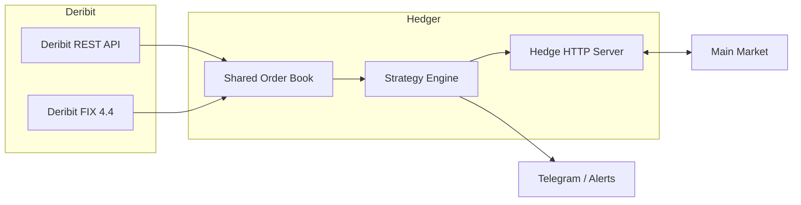

# OptionsHedger

OptionsHedger is a high-performance **options hedging engine** for BTC options on Deribit.  
It is designed with **low latency**, **atomic memory updates**, and **FIX protocol integration**, making it suitable for systematic hedging and HFT (high-frequency trading) strategies.

---

## Architecture Overview

The system is composed of five key components:

1. **FIX Layer**  
   Subscribes to option market data + BTC index via the Deribit FIX API.

2. **REST Layer**  
   Provides authentication and instrument metadata (expiry, strike, etc).

3. **Data Layer**  
   Shared memory with atomic writes/reads of order book and index price.

4. **Strategy Engine**  
   - Consumes real-time order book data.  
   - Detects arbitrage/hedge opportunities.  
   - Generates trade signals.  

5. **Servers & Notification**  
   - Exposes HTTP endpoints for target/close requests.  
   - Sends alerts via Telegram.  

---

## Architecture Diagram




---

## Features

- **Deribit Authentication**
  - Supports both REST API JWT token fetching and FIX login with nonce/timestamp authentication.

- **Order Book Management**
  - Shared memory order books with cache-line alignment for HFT performance.
  - Atomic updates and lock-free reads using `sync/atomic`.

- **Market Data (FIX)**
  - Subscribes to BTC option instruments and BTC index price via FIX 4.4.
  - Optimized parsing for incremental (X) and snapshot (W) messages.
  - O(1) symbol lookup with pre-indexed option universe.

- **Strategy Engine**
  - Current implementation: **Box Spread HFT** (risk-neutral arbitrage between strikes).
  - Infrastructure supports additional strategies (Expected Move Calendar, Collars, etc.).
  - Strategy signals are logged and optionally sent to Telegram.

- **HTTP Hedge API**
  - `/hedge/target`: Set hedge target (side, qty, base, index).
  - `/hedge/update_mm`: Push main-market unrealized PnL updates.
  - Allows coordination between hedger and main market positions.

- **Notifications**
  - Optional Telegram integration for alerts (entry, exit, close-all).

---

## Requirements

- **Go** 1.21+ (tested with Go 1.22)
- **Deribit Account**
  - API keys (client ID & secret) with trading permissions.
- **QuickFIX/Go**
  - FIX engine for Deribit connectivity.
- **Environment Variables**  
  Required:
  ```bash
  DERIBIT_CLIENT_ID=your_client_id
  DERIBIT_CLIENT_SECRET=your_client_secret
  ```

Recommended / optional:
```bash
# Strategy selection (if multiple strategies present)
STRATEGY="box_spread"
# HTTP server
HEDGE_HTTP_ADDR="127.0.0.1:7071"
# Telegram notifier (see notify.NewTelegramFromEnv)
TELEGRAM_TOKEN="..."
TELEGRAM_CHAT_ID="..."
```

---

## Build & Run

1. Fetch dependencies and build:
```bash
go mod tidy
go build -o hedger ./cmd/hedger
```

2. Export required environment variables (example):
```bash
export DERIBIT_CLIENT_ID="your_id"
export DERIBIT_CLIENT_SECRET="your_secret"
export HEDGE_HTTP_ADDR="127.0.0.1:7071"
```

3. Run:
```bash
./hedger
```

The binary will:
- Fetch instrument list via REST,
- Initialize FIX market data subscription,
- Start the strategy engine and HTTP endpoints.

---

## HTTP API

- `POST /hedge/target` — Set hedging target.
  - Example payload:
  ```json
  {
    "seq": 123,
    "type": "SNAPSHOT",
    "side": "LONG",
    "qty_btc": 0.0012,
    "base_usd": 111000,
    "index_usd": 111000.5,
    "ts_ms": 1690000000000
  }
  ```

- `POST /hedge/update_mm` — Push main market unrealized PnL (optional).
  - Example payload:
  ```json
  {
    "seq": 124,
    "main_pnl_usd": 150.25,
    "ts_ms": 1690000001000
  }
  ```

Responses are JSON `{"ok": true}` when accepted (or `{"ok": true, "ignored":"stale_seq"}` if stale).

---

## Troubleshooting

- If Mermaid diagrams fail to render on GitHub, ensure you are using a GitHub page or viewer that supports Mermaid. The diagram in this README uses simple labels to maximize compatibility.
- If FIX subscriptions don't show market data:
  - Verify `quickfix` configuration file path passed to `fix.InitFIXEngine`.
  - Confirm DERIBIT FIX credentials and session settings.
  - Check logs for "OnLogon received" and "MarketDataRequest sent" messages.
- If Order Book is empty:
  - Confirm FIX messages are arriving and `data.ApplyUpdateFast` is being called in `fix.App`.
  - Check `data.SharedMemoryPtr()` log at startup for a valid pointer.

---

## Contributing

Contributions are welcome. Typical workflow:

1. Fork the repository.
2. Create a branch for your feature/fix.
3. Open a pull request with tests and a clear description.

Please follow project coding conventions (low-allocation patterns, explicit environment configuration).

---

## License

This project is licensed under the **Apache License 2.0**. See the `LICENSE` file for details.

---

## Contact / Support

Contributions are welcome. Please open issues for bugs or feature requests, and submit pull requests for fixes/improvements.
